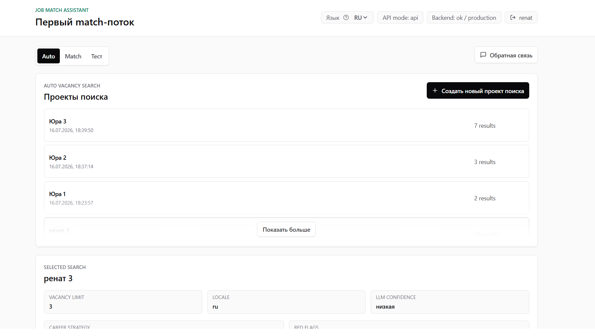
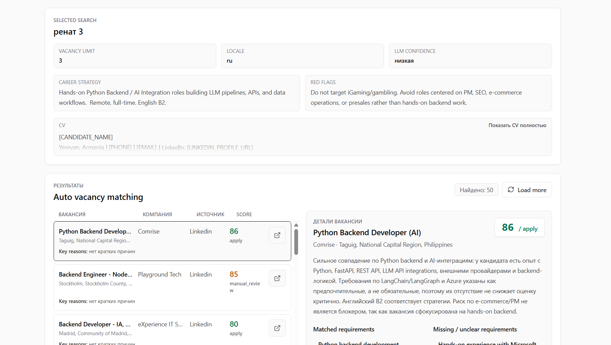
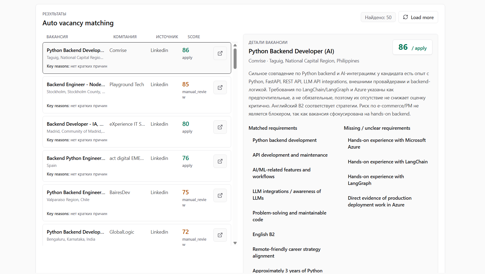
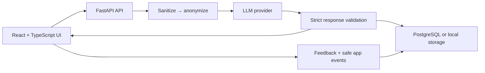

# Job Match Assistant

[](https://github.com/RenatZahar/job-match-assistant-showcase/actions/workflows/ci.yml)

An AI-assisted web application that compares a CV with a job description and returns an explainable, structured match assessment.

**Live demo:** [job-match-assistant.pages.dev](https://job-match-assistant.pages.dev/)

**API health:** [job-match-assistant-api-prod.onrender.com/health](https://job-match-assistant-api-prod.onrender.com/health)

> The hosted backend uses a free-tier service and can take a short time to wake up after inactivity.

## Why this project exists

Job descriptions are ambiguous, CVs contain sensitive data, and a single match score is not useful without evidence. This project turns those inputs into a validated result with:

- a 0–100 match score and recommendation;
- matched and missing requirements with evidence;
- red flags and a transparent score breakdown;
- a privacy boundary before any external LLM call;
- feedback and operational metadata for future evaluation.

## Current status

| Capability                        | Status                                       |
| --------------------------------- | -------------------------------------------- |
| Manual CV-to-vacancy analysis     | MVP, available in mock or OpenAI-backed mode |
| CV sanitization and anonymization | Implemented and covered by tests             |
| Structured LLM output validation  | Implemented with strict schema validation    |
| Feedback and app-log persistence  | Local files or PostgreSQL                    |
| Automatic vacancy search          | Experimental; requires provider credentials  |
| Authentication                    | Optional HTTP Basic for the portfolio MVP    |

The default local setup uses deterministic frontend mock matching. It needs no API key and makes no paid provider calls. Real match evaluation is opt-in.

## Product walkthrough

The screenshots use anonymized data and show the experimental automatic-vacancy flow from saved searches to an explainable ranking.

### Saved search projects



### Search context and ranked results



### Explainable vacancy assessment



## Architecture



The browser never calls an LLM provider directly. Raw CV input is sanitized and anonymized before provider evaluation, and raw CV text is excluded from feedback and operational logs. See [Architecture](docs/architecture.md) and [Security & privacy](docs/security.md).

## Tech stack

- Frontend: React 18, TypeScript, Vite, TanStack Query, Tailwind CSS
- Backend: Python 3.12, FastAPI, Pydantic, Psycopg
- Data: PostgreSQL locally; Neon in the hosted environment
- Hosting: Cloudflare Pages + Render
- Quality: Pytest, Vitest, TypeScript build checks, GitHub Actions

## Quick start with Docker

Prerequisite: Docker Desktop or Docker Engine with Compose v2.

```bash
git clone https://github.com/RenatZahar/job-match-assistant-showcase.git
cd job-match-assistant-showcase
docker compose up --build
```

Open:

- frontend: <http://localhost:5173>
- backend docs: <http://localhost:8000/docs>
- health check: <http://localhost:8000/health>
- database health: <http://localhost:8000/health/db>

The Compose stack starts the frontend, backend, and PostgreSQL. It defaults to `VITE_MATCH_API_MODE=mock`, so it is safe to run without OpenAI or Bright Data credentials.

Stop the stack:

```bash
docker compose down
```

Remove the local database volume only when you intentionally want a clean database:

```bash
docker compose down --volumes
```

## Run without Docker

Prerequisites: Python 3.12+ and Node.js 22.12+.

### 1. Backend

Create the root environment file:

```powershell
Copy-Item .env.example .env
```

On macOS/Linux, use `cp .env.example .env`.

Then install and run the API:

```powershell
python -m venv .venv
.\.venv\Scripts\Activate.ps1
python -m pip install -e ".\backend[dev]"
python -m uvicorn app.main:app --app-dir backend --reload
```

macOS/Linux activation command: `source .venv/bin/activate`.

`DATABASE_URL` is optional for this mode. When it is empty, safe feedback and app events use ignored local directories instead of PostgreSQL.

### 2. Frontend

In a second terminal:

```powershell
Set-Location frontend
Copy-Item .env.example .env.local
npm ci
npm run dev
```

On macOS/Linux, replace `Copy-Item` with `cp`.

Open <http://localhost:5173>. The frontend environment file defaults to mock matching and points health/feedback requests to the local API.

## Enable real LLM evaluation

Real evaluation is optional and may incur provider cost.

1. Set `OPENAI_API_KEY` in the root `.env`.
2. Keep the key server-side; never add it to `frontend/.env.local`.
3. Set `VITE_MATCH_API_MODE=api` in `frontend/.env.local`.
4. Restart both processes. Vite variables are read at build/start time.

The automatic vacancy-search experiment additionally requires Bright Data configuration. It is not required for the core manual matching flow.

## Tests and build

Backend:

```powershell
python -m pytest -q backend/tests/smoke_tests
python -m ruff check backend
```

Frontend:

```powershell
Set-Location frontend
npm ci
npm test
npm run build
```

Automated tests use mocks or deterministic paths by default and do not call paid LLM/provider APIs.

## Deployment

- Render backend configuration: [`render.yaml`](render.yaml)
- Cloudflare Pages settings: [`infra/cloudflare-pages.md`](infra/cloudflare-pages.md)
- Complete deployment and verification guide: [`docs/deployment.md`](docs/deployment.md)

## Repository map

```text
backend/app/            FastAPI routes, privacy pipeline, provider adapters, persistence
backend/tests/          Backend smoke and contract tests
frontend/src/           React UI and typed API adapters
frontend/src/api/       Browser-to-backend contracts
docs/                   Reviewer-facing architecture, security, and deployment notes
infra/                  Hosting-specific settings
compose.yaml            Reproducible local stack
render.yaml             Render Blueprint
```

## Ownership and AI assistance

This is an AI-assisted portfolio project. I own the backend architecture, data contracts, validation, privacy pipeline, tests, evaluation logic, and deployment decisions. AI tools helped with review, frontend scaffolding, documentation, and boilerplate suggestions.

The repository is a curated public showcase. Private test data, raw CVs, provider credentials, internal work logs, and research archives are intentionally excluded.

## License

This project is source-available under the [PolyForm Free Trial License 1.0.0](LICENSE). You may deploy and evaluate it for fewer than 32 consecutive calendar days. Redistribution and use outside that evaluation require separate permission from the copyright holder.
