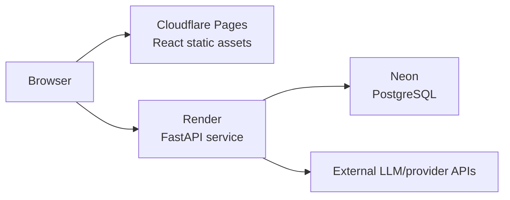

# Architecture

## Scope

The portfolio MVP supports one primary flow:

```text
manual CV + career strategy + red flags + vacancy
  -> input validation
  -> sanitization
  -> anonymization
  -> LLM evaluation
  -> strict response validation
  -> result and safe operational metadata
```

Automatic vacancy discovery is an experimental extension. It uses a separate provider adapter and is not required for the manual matching flow.

## Components

### Frontend

The React/Vite application owns form state, client-side validation, rendering, and typed adapters for the backend endpoints. Provider keys are never exposed to the browser.

Important paths:

- `frontend/src/App.tsx`: current product UI;
- `frontend/src/api/`: typed HTTP adapters and response normalization;
- `frontend/src/env.ts`: public build-time environment contract.

### Backend

FastAPI owns trust-boundary validation, file text extraction, privacy processing, provider calls, structured output validation, and persistence.

Important paths:

- `backend/app/main.py`: API composition and routes;
- `backend/app/endpoint_models.py`: request and response contracts;
- `backend/app/modules/anonymizer_n_privacy.py`: sanitization and anonymization;
- `backend/app/modules/open_ai_provaider.py`: server-side LLM adapter;
- `backend/app/feedback_storage.py`: safe feedback and event persistence;
- `backend/app/modules/db/`: PostgreSQL-backed storage.

### Persistence

For a zero-infrastructure local run, feedback and safe app events can use ignored local files. When `DATABASE_URL` is set, the same paths use PostgreSQL. Docker Compose starts PostgreSQL and wires it automatically.

The hosted deployment uses Neon Postgres. Connection strings remain hosting secrets and are never committed.

## Deployment topology



Cloudflare Pages receives only public `VITE_*` variables. Render receives server-side secrets and restricts browser access through `CORS_ORIGINS`.

## Deliberate trade-offs

- HTTP Basic auth is adequate only for the current portfolio MVP; production multi-user auth is future work.
- The frontend includes a deterministic mock mode so reviewers can explore the UI without credentials or provider cost.
- Database tables are created lazily by the small MVP storage modules. A migration system is the preferred long-term direction.
- Provider-dependent automatic search remains experimental and is separated from the reliable manual-input path.
